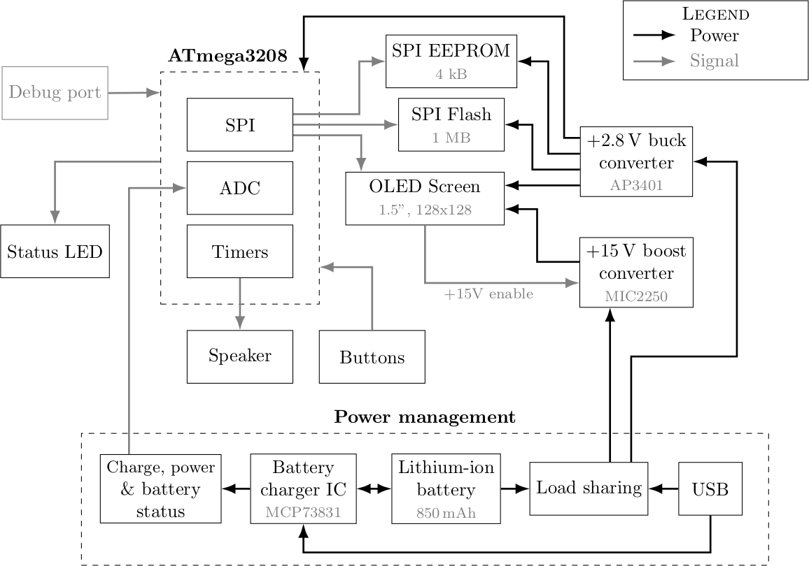

# Handheld game console

A small six-button handheld game console with a bootloader and games stored in external flash memory.
A complete solution was created to create, simulate, compile and upload apps for the device.

   

There are currently 2 games written for the console:

- [Tetris](sw/app/tetris)
- [Tile World](sw/app/tworld)

## Specifications

- Display: 1.5" OLED 128x128, 4-bit gray.
- MCU: ATmega3208 @ 10 MHz, 4 kB RAM, 32 kB ROM (bootloader uses 8.25 kB).
- Memory: 4 kB EEPROM (up to 64 kB), 1 MB flash (up to 8 MB).
- Physical: 40 mm x 71 mm x 15.4 mm, 60 g.
- Battery: 850 mAh Li-Po, 5-20h active, several months standby, USB micro B charging.

### Hardware

- MCU: ATmega3208, compatible with ATmega4808, AVR128DA28, AVR64DA28, AVR32DA28 (none tested).
- EEPROM: FT25C32A, 4 kB (compatible with same series devices)
- Flash: AT25SF081B, 1 MB (compatible with 25-series flash devices)
- Display: EastRising ER-OLED015-3 (SSD1327 display controller, 15V VCC)

## Tools and building

Everything was built and tested on Linux only (Ubuntu 20.04).
The PCB was made in KiCAD 6 and the enclosure was made in FreeCAD 0.19.
Building and using the software requires the following tools and libraries:

- AVR GCC >= 5.4.0 (7.3.0 used)
- GCC >= 9
- Python >= 3.7
- freeglut, pulseaudio, libpng

## Architecture

The architecture of the software is described in details in [`sw/README.md`](sw/README.md).

## Project structure

- `hw`: PCB and enclosure
- `sw`: all software SDK including programming utility and all apps.
- `docs`: documentation source files

## License

All code is licensed under Apache License 2.0 and all assets are licensed under
Creative Commons v4.0, unless otherwise indicated.
Bitmap fonts were taken from the [u8g2](https://github.com/olikraus/u8g2/wiki/fntlistall) 
project and are not my work. Credits to my brother for making the game music.
