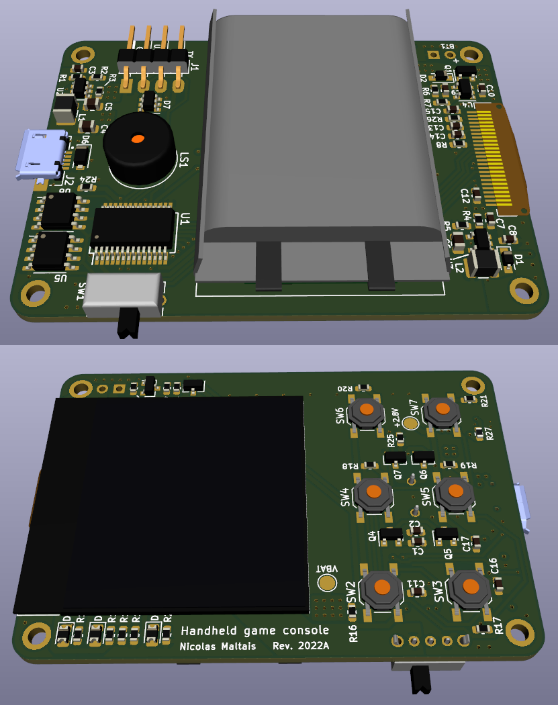
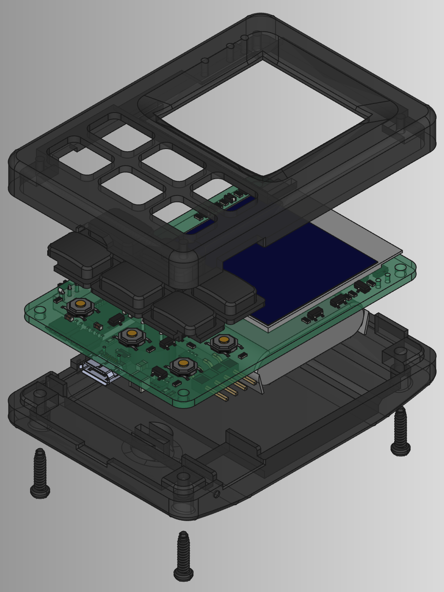

# Game console hardware

## PCB

The PCB was designed in KiCAD 6.
Two revisions were made, but only the first revision was manufactured
since it was already working with minor changes.

### Revisions

#### Revision 2021A

- Initial revision.

#### Revision 2022A

- Added pull downs on the H-bridge.
- Removed power monitor due to lack of on board capacity (was originally meant to monitor 
  shut off and alert the MCU to do last minute operations).
- Removed low power reset monitor on the MCU, it caused reset when disconnecting
  the USB cable due to momentary drop on 2.8V power rail.
- Changed the battery connector which was too small.

Other notable changes that should be made:

- Battery discharge current reading at ADC to allow better SoC estimation.
- Attempt to reduce high pitch noise (related to either display or 15V boost, 
    may be due to ceramic caps oscillating).
- Increase clearance around buttons for better mechanical integration.
- Remove unused H-bridge to drive speaker (only one side used).

## Enclosure

The enclosure was designed in FreeCAD and 3D printed in black MJF Nylon.
The design is fine considering this was my first experience with 3D modeling
and considering that it wasn't planned for carefully at the time of designing the
PCB. The button design could have been better, they sometimes get stuck and
don't click, but this is usually not an issue.
