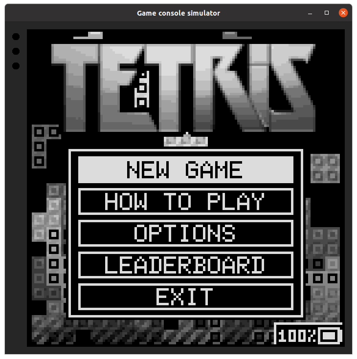
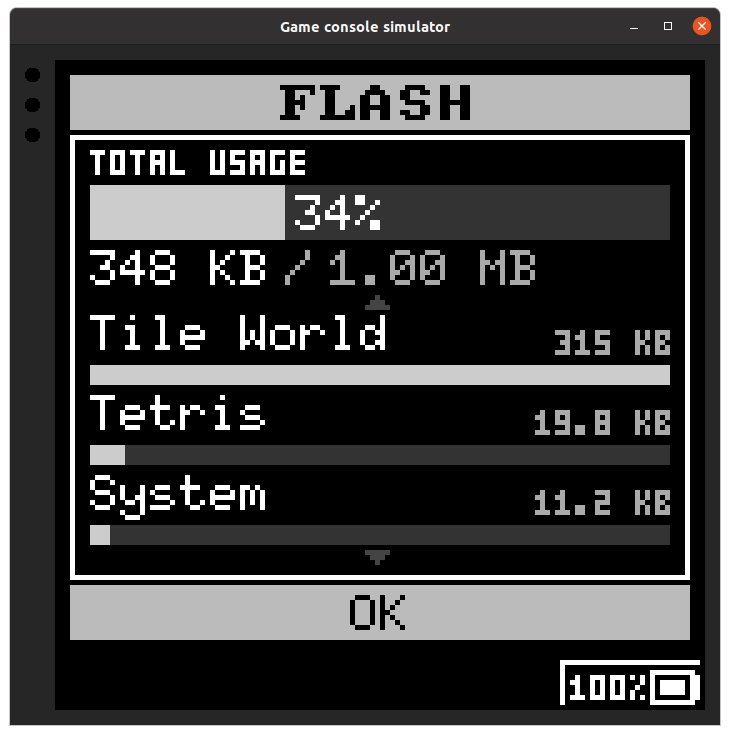
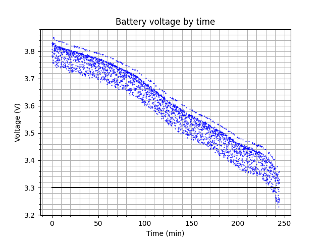
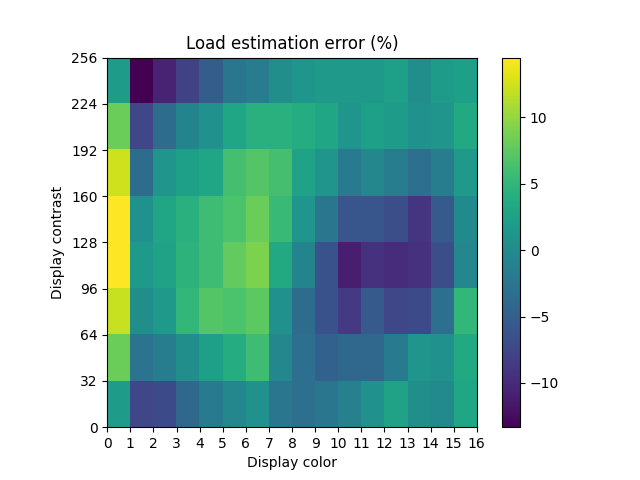
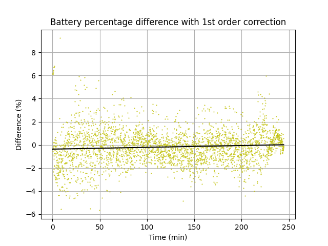
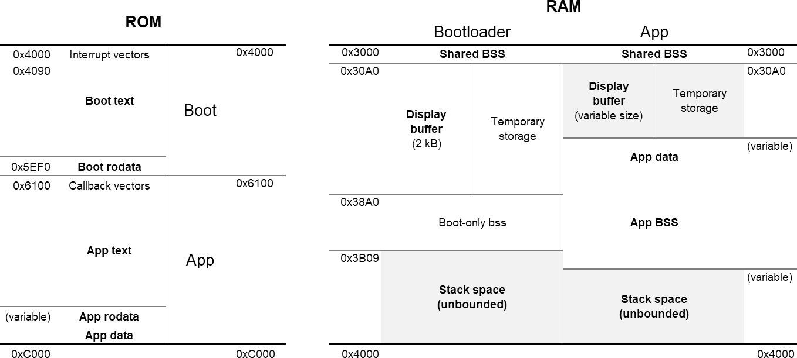

# Game console software

The game console uses an ATmega3208 MCU with 32 kB of ROM and 4 kB of RAM.
The code could easily be ported to MCUs of the same familiy (ATmega4808, AVRxxDA28).
All the code running on the console is written in C, with C++ used only for testing
and Python for utilities.

## Building

Everything is built using Makefiles. The main Makefile includes other files depending on the
build command (simulation, test). A different Makefile is used for AVR, simulation, and testing.
In this text, a *target* refers to either an app or the bootloader, is not to be confused 
with a *Make* target.

Start by making a copy of the `toolchain.template.mk` file and rename it to `toolchain.mk`.
This file will be included from the main Makefile and is used to specify toolchain directory
(avr-gcc and ATmega DFP).

Every target can be built using a variation of the following command:

```shell
make all TARGET=<target-dir> [SIM=<0-1>] [TEST=<0-1>]
```

For exemple:

```shell
make all TARGET=boot  # bootloader, AVR
make all TARGET=boot SIM=1  # bootloader, simulator
make all TARGET=app/system  # system app, AVR
```

Running tests with `TEST=1` is described in a subsequent section.
The bootloader must be built before any app to correctly link with the bootloader functions.
Other noteworthy Make targets include:

- `assets`: only generate assets file, using packing script.
- `compile`: only generate binary file (compile & link).
- `disasm`: output AVR disassembly in build directory.
- `size`: output size information on the AVR binary.

Building creates a `build/` directory in the target's directory, with separate subdirectories
for AVR (`SIM=0` or unset) and the simulator (`SIM=1`).
Note that when switching targets, it may be best to do a full clean, especially
when building the bootloader, since some build related issues have been known to occur.

## Simulation

A GLUT-based graphical simulator is provided to test the bootloader and the apps.
The simulation can be built using the `SIM=1` parameter as explained above.
Nearly all subsystems are simulated: display, input, sound, LEDs, sleep, time keeping,
power management, etc. SPI protocols for the flash and EEPROM are emulated, but not for the display.
UART communication can be done with another application through a socket.
It's notably possible to program the memories with gcprog in simulation.

Simulation reduces considerably the time spent debugging on the actual hardware.
More debugging tools are available in simulation: the GCC sanitizer, `-O0` has little impact on
performance, all symbols are present during debugging, screenshots can be taken of the display, etc.
Moreover, the project doesn't depend on Microchip proprietary debugging tools
and the simulator has helped tremendously with debugging in this regard.

 

Notable simulation pitfalls:

- `uint24_t` is defined as a `uint32_t` which may hide some bugs.
- `SHARED_DISP_BUF` has no effect and memory is allocated separatedly.
- Some code is written for a little-endian machine and will not work otherwise.

## Programming

The MCU is programmed via the UPDI protocol, using [pymcuprog](https://pypi.org/project/pymcuprog/).
The SerialUPDI feature is used, the connection is illustrated in the link given. 
During development, a serial adapter with two interfaces has been used, 
one interface connected to the UPDI and the other connected to the game console UART.
All programming is done via a dedicated port with the following pins: TX, RX, UPDI, GND.
The micro USB port is only used for charging.

The bootloader doesn't allow installing apps directly. The communication protocol is instead
implemented in an app, the system app, to reduce the bootloader code size.
When first programming the device or when making changes to the bootloader, this poses a problem
since either the system app is not installed, or it is wrongly linked with the new bootloader.
To counteract this issue, a special Make target is provided to combine both the bootloader and
an app in a single HEX file and flash both at once.
Upon detecting that there are no installed apps or none are compatible with the new bootloader 
version, the bootloader immediately jumps to the app setup without loading the app first.
This Make target is used as follows:

```shell
make preload TARGET=boot PRELOAD=app/system
```
This compiles the bootloader, the system app, and upload the code to the device.
The bootloader can also be flashed by itself with:
```shell
make upload TARGET=boot
```

When developing apps and not changing the bootloader, UPDI isn't used.
The UART interface, the system app, and gcprog are used instead to install, uninstall or modify apps.
Some commands include:
```shell
utils/gcprog.py list  # show details about installed apps
utils/gcprog.py install <app-image>  # to install or update
utils/gcprog.py uninstall <app-id>  # to uninstall
utils/gcprog.py data <app-id> -w <input-file>  # to write EEPROM data
utils/gcprog.py data <app-id> -r <output-file>  # to read EEPROM data
utils/gcprog.py data <app-id> -e  # to erase EEPROM data
```
Before installing an app for the first time, the flash and EEPROM must be initialized
(initialize the index and write the signature):
```shell
utils/gcprog.py init
```
Note that communication will fail if device is sleeping or the system app is not loaded.
All communication is done at a 250K baud rate.
If any operation fails, it should be retried to avoid leaving the device in an invalid state.

App images have a `.app` extension and are generated automatically when building an app using
the app HEX file and the assets generated by the assets packer to be stored in flash.
This is done by the `utils/app_packer.py` script.

## Battery calibration

Battery calibration is performed by first taking measurements with `utils/gcprog.py battery --calib`,
then analyzing the measured data with `utils/battery_calib.py` and writing the resulting file to the
internal EEPROM with pymcuprog.

The battery percentage estimation process is very approximate even with the calibration.
Since the hardware has no battery monitor, current monitor, or any specialized hardware to track
the SoC other than the battery voltage, everything must be derived from the latter.
One key problem is that battery voltage varies with load, and the current is unknown.
As such, the load is estimated using the average screen color and contrast since these are the
main load parameters, with the display accounting for over 90% of the current consumption (figure 2).
Points are taken from the discharge voltage curve and simple interpolation can give an approximate
battery level (figure 3).
Overall this works very badly, but it's better than nothing!

  


## Architecture

The game console architecture is centered around the fact that resources are limited.
As such, core functions are optimized for performance and size, and all RAM usage is accounted for.
Optimization and achieving a lot with little were core goals of this project, so many architecture
decisions made tend to complicate things and would not be relevant to other projects.

Although nearly all the code is written in C and only a little Assembly, the disassembly has 
often been inspected during development to ensure proper performance and small code size.

This may explain some oddities, for example: 
- Use of gotos, unions, absence of switch statements.
- `uint24_t` data type used profusely to save one byte.
- Abundant use of bitwise arithmetic.
- Strict use of volatile.
- Uninitialized local variables.
- Seemingly unneeded shifts to infer nibble swap instruction. 
- General lack of protection and validation (compensated by using the simulator).

### Bootloader and app

The compiled code is split into two parts: the "bootloader" and the "app".
A list of callbacks is defined to serve as a kind of interrupt vector.
The bootloader is linked against symbols with the predefined addresses of the callback vector table,
as defined in `boot/callbacks.sym`.
Despite its name, the bootloader keeps control of the program execution at all times, even after
an app has been started. The main loop is located in the bootloader and handles low level tasks
like filling sound track buffers and power management.
Callbacks are called to give control to the app, for updating, drawing, power management 
events, etc. Some MCU interrupts are forwarded to a callback.
The bootloader currently has support for up to 32 different apps, but this is easily changed.

The bootloader also has several functions marked as noinline to allow them to be called from the
app and save on code size. This is a bit unwiedly but there seemed to be no alternative short of
writing a script to identify these functions and mark them automatically (if that's even possible). 
Symbols for statically allocated variables and for the noinline functions are
output to the `boot/build/boot.sym` file during build to allow the app to link against them.
These symbols are not defined at all when compiling the app to force the linker to use the existing
symbols. Some symbols are prefixed with an underscore `_` to avoid ending up in that file.

To load an app, the bootloader copies its code from the external flash memory to the section in
internal program memory reserved for that purpose. This is not ideal as the internal memory has
a limited number of write cycles (10000), but this issue is not significant.
The MCU costs 1$ in any case, so I'll replace it if it ever fails.
When copying program data, the CRC is checked to ensure correctness.
The bootloader then initializes offsets within the flash and EEPROM for relative reads and
jumps to the setup callback to allow the app to initialize itself.

### Flash & EEPROM index

The memory layout for the external flash and EEPROM is described in `include/sys/flash.h` and
`include/sys/eeprom.h` respectively. In both cases, an index is present to indicate how much space
each app has allocated in it. The flash index also has more info (version, name, CRC, etc).
The indices are updated by the gcprog script when installing and uninstalling apps.

### Memory layout & linking

There is a linker script for the bootloader and one for the app.
Note that numbers given here are for the ATmega3208 and may change if ported to another device.

The bootloader occupies the first 8.25 kB of the program memory, leaving 23.75 kB for the app.
As for RAM, since both parts (bootloader & app) run at the same time, some sections are shared and used by both.
The app has access to 3 936 bytes of RAM to store its data, the display buffer and the stack.

Some variables may be placed alongside the display buffer to be used as temporary storage when
the display buffer isn't used. The boot-only is for variables used only before loading an app.
The display buffer may have a different size in the bootloader and the app.
Sufficient space must be left for the stack when designing an app.
The memory layout is illustrated in the figure below. Gray sections are uninitialized.
BSS sections are zero initialized.



A custom script to report the bootloader and app size is located in `utils/`
to replace the traditional `avr-size` which doesn't work with custom linker scripts.

### Project structure

#### Core library

The core library is the "safe" API meant to be used from an app.
The implementation of this library is in the `core/` directory and is the same for AVR and 
the simulator. The header files are located in `include/core/`.

Several functions are only a thin wrapper around a system library function.
Note that there are a few `sys_` prefixed functions implemented in the core library,
to allow using the same implementation for the simulator, without making part of the core API.

#### System library

The system library implements all the low level logic and can be seen as a kind of high level HAL.
The system library API is accessible from the app but not necessarily safe to use.
It handles power management, GPIOs, external memory and display interfacing, etc.
This library has two implementations, one in `sys` for AVR, and one in `sim` for the simulator.
The header files are located in `include/sys/`.
The simulator also implements extra functionality for debugging available through the
header files in `include/sim`.

Note that the system library exposes several global variables.
Unless under specified, these are never meant to be used directly, they are declared as extern
(and not static) for linking purposes.

#### Boot library

This library is an extension of the system library used only by the bootloader.
It is not linked with the app, therefore it's not accessible from it.
There is also two implementations of this library, for AVR and the simulator.
The header files are located in `boot/include/boot/` and the implementation is located
alongside the system library implementation in `sys/` and `sim/`.

#### Bootloader

The bootloader is located in the `boot/` directory.
See the [Bootloader and app](#bootloader-and-app) section for description of the bootloader.

#### Apps

Apps are all located in a subfolder of the `app/` directory.
Each app must follow the same file and directory structure:

- `assets/`: assets files.
- `include/`: header files.
- `src/`: implementation files.
- `test/`: test source files (if any).
- `target.cfg`: configuration file.
- `target.mk`: Makefile included during build.
- `pack.py`: script used to pack assets.

The `target.cfg` file contain the following fields:
- `id`: app ID, must be unique (required).
- `version`: app version (required).
- `title`: app name/title (required).
- `author`: author name (required).
- `display_page_height`: initial display page height set when loading the app (required).
- `eeprom_space`: size in bytes reserved in EEPROM (optional, default 0).

The assets packing script is run when using the `all` or `assets` Make targets.
The script generates a header file in `include/assets.h`, a data file with packed assets 
`assets.dat` and in some cases another data file `src/assets.c` for assets stored internally.

#### Test

The project contains very little tests.
The only tests present for the core functionality are those for the graphics module.
They were mostly used for regression testing after making optimizations.

Tests for a particular target (including the `test` target) can be run with the following command:
```shell
make test TARGET=<target-dir> TEST=1
```

The tests run in headless simulator mode, meaning the simulator has no `main`, no GUI, 
produce no sound, but other simulated system functions are still available and time is controllable.

#### Utilities

All utilities are written in Python and contained in the `utils/` directory.
Requirements can be install with:
```shell
pip3 install -r requirements.txt
```

- `avr_size.py`: replacement for `avr-size`, mentionned above.
- `boot_sym_filter.py`: used to generate the `build/boot/boot.sym` file.
- `assets_packer.py`: used from `pack.py` scripts to encode assets and 
    pack them to a single binary file.
- `app_packer.py`: packages app code and data into a single binary file used by gcprog.
- `gcprog.py`: short for Game Console Programmer, used to manage apps on the device.
    This utility can also be run in "local" mode to generate flash and eeprom images 
    for the simulator.
- `battery_calib.py`: used to analyzed measured battery data to generate calibration data.

Utilities for encoding assets are also usable as standalone applications:

- `assets/image_gen.py`: various image formats -> encoded image
- `assets/sound_gen.py`: MIDI sound file -> encoded sound tracks
- `assets/font_gen.py`: 1-bit image with font glyphs -> encoded bitmap font

### Defines

There are several special defines that are set during compilation:

- `BOOTLOADER`: the bootloader is present in the build (always true during simulation).
- `SIMULATION`: the simulation is being built.
- `SIMULATION_HEADLESS`: the simulation is being built without the main function.
- `SIM_MEMORY_ABSOLUTE`: external memories are used in absolute mode (i.e. the whole memory is loaded).
- `TESTING`: tests are being built.
- `RUNTIME_CHECKS`: enables runtime checks in several locations (usually for simulation).


## Resource usage

The following peripherals and interrupts are used in the microcontroller:

- All GPIOs except PA7.
- `GPIO`: all 4 general purpose I/O registers (`PORTD_PORT`).
- `BOD` (set by fuse at 1.8V)
- `RTC`: time keeping (system tick), power monitoring, sound updates (`RTC_CNT`).
- `PIT`: power monitoring (`RTC_PIT`).
- `ADC0`: used for reading battery level (`ADC0_RESRDY`).
- `USART0`: used for communication in system app (`USART0_DRE`, `USTART0_RXC`).
- `SPI0`: used to communicate with display and external memory.
- `TCA0`: split mode, all 3 HCMP channels used for generating sound PWM.
- `TCB0`: sound channel 0 (`TCB0_INT`).
- `TCB1`: sound channel 1 (`TCB1_INT`).
- `TCB2`: sound channel 2 (`TCB2_INT`).


## Modules

The core, system and boot libraries are separated into similarly named modules
encompassing similar functionality. Notable modules are:

- **data**: provides an unified memory map to load data from the external flash or
    the internal program memory. Used to load all built-in asset types.

- **dialog**: provides basic dialog UI to have an unified looks across apps.

- **display**: functions related directly to the display (contrast, display buffer, etc).
    Note that the display is updated in a paged way 
    ([explained here](https://github.com/olikraus/u8glib/wiki/tpictureloop)),
    to use less RAM, since there's not enough RAM to contain the whole display buffer.
    The page height is variable at runtime.

- **eeprom**: external EEPROM reading and writing (atomically).

- **flash**: external Flash reading.

- **graphics**: graphics primitives (lines, rectangles, text, images), built upon the display module.
    The image format and the font format are described in `core/graphics.h`.

- **init**: low-level initialization of registers, initialization of other modules.

- **input**: handles user input (buttons) and inactivity sleep.

- **led**: handles the status LED.

- **power**: handles power monitoring and management, sleep and sleep scheduling, 
    battery level estimation.

- **sound**: handles sound tracks, decoding sound data, driving the speaker.
    The sound format is described in `core/sound.h`.

- **time**: keeps track of system time, in ticks (1/256th of a second).
    Also takes care of periodic updates for other modules (sound, led, input).

- **uart**: available by defining `SYS_UART_ENABLE`, provides UART communication functionality.
