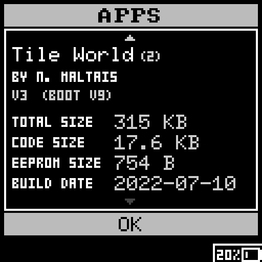
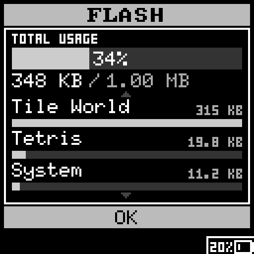
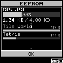
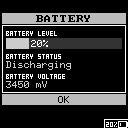

# System app

The system app is used to view system status: installed apps, flash & EEPROM usage,
battery level and status.
The app also implements the communication protocol to program the Flash and EEPROM
from `gcprog.py`.

 
 

The simulator emulates the UART communication with sockets.
Since the Flash and EEPROM SPI interfaces are also emulated, `gcprog.py` can be fully
tested in the simulator. This is done using the `--sim` flag.
