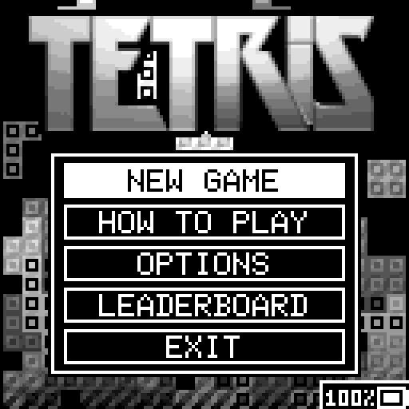
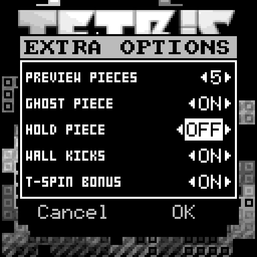

# Tetris

Simple Tetris implementation, with rules as specified by the 
[Tetris Guideline](https://tetris.wiki/Tetris_Guideline).

 
 

**Features:**

- 10x22 game grid.
- Up to 5 pieces preview (configurable).
- Ghost piece (can be disabled).
- Hold piece (can be disabled).
- Wall kicks to move blocked piece on rotation.
- T-Spin, perfect clear, combo and back-to-back scoring rules.
