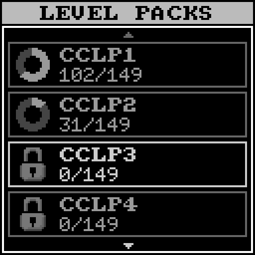

# Tile World

This game is an implementation of [Chip's Challenge](https://wiki.bitbusters.club/Chip%27s_Challenge),
originally released on the Atari Lynx but more commonly known for the version shipped with early 
Windows versions.
The game is more specifically a very close copy of [Tile World](https://wiki.bitbusters.club/Tile_World) (v1.4.0).
The original source code is available [here](https://github.com/Qalthos/Tile-World).

 
 

**Features:**

- Fully compatible with the Lynx ruleset.
- Level pack selection and level selection.
- Using a password to go a level.
- Best level time is saved upon completion.
- Help dialog for tile types (helps with knowing which key is blue and which button is red on a grayscale display!)

The implementation is very similar to Tile World's, with a few changes to reduce the memory usage:

- Actor list is limited to 128 actors.
- Static actors and ghost blocks are introduced to avoid this limit.
- `cr->tdir` and `cr->fdir` are not used, only `cr->dir`.
- No per creature flags (slide token, reverse, pushed, teleported).
    These are replaced by a state value and should be 100% equivalent.
- Only actor position, stepping and state are stored in actor list,
    the rest is taken from the grid (entity, direction).
- Instead of "move laws" array, the tile IDs were remapped carefully to reduce
    the amount of logic needed to determine whether the tile is a wall.
    The ID remap is shown below.

### Resource usage

#### Memory 

- Display buffer: 1408 B (6 pages of 22 px).
- Level grid: 1536 B.
- Actor list: 256 B.
- Other level state: 30 B.
- Dialog module: 62 B.
- Misc. game state: 42 B.
- **Total**: 3334 B (+ stack space).

#### CPU

Drawing routines for tiles are optimized so that the game can be run at best at 
16 FPS (i.e. one game step per display refresh), and usually in the 12-15 FPS range.
Refresh rate will be lower if many actors are on screen or if level has many active actors
but should not normally go under 8 FPS during gameplay.

### Tile IDs

The game grid is made of two layers: the top layer and the bottom layer.
The bottom layer is always static and the top layer contains only actors.
Tiles on both grids are encoded on 6 bits, as follows:


**Notes**

**[0]**: Static tiles are like their counterpart but actors placed on them are static (i.e. not added to the actor list). \
**[1]**: These IDs match the `is_key` macro. Keys were split since the blue and red keys act as floor unlike the yellow and green keys. \
**[2]**: Tanks have a "reversed" variant to replace the `REVERSED` flag that couldn't added due to memory limitations. \
**[3]**: These tiles appear non-directional so a static variant exist that isn't added to the actor list (but can still kill). \
**[4]**: Ghost blocks are not initially added to the actor list, only when pushed. \
**[5]**: Tiles only used internally for extra bottom tile images, not encodable in level data.

### Level packs

The included level packs are community-created CCLP1, CCLXP2, CCLP3, and CCLP4,
for a total of 596 levels.

Minor changes were made to some levels to accomodate the actor list limit, but they remain solvable,
most of the time with the official TWS (labeled with "no effect"). 
All changes made to the levels are described below.
Note that without these changes and by temporarily disabling the actor limit in the Python
implementation, all tests pass with the original TWS solutions.

Level titles and hints were kept as is, without changing mentions of colors, like "blue key" or
"red button", despite the screen being grayscale. This is slightly annoying but easy to adjust to.

#### [CCLP1](https://wiki.bitbusters.club/CCLP1)

- Level 99: ghost blocks used.
- Level 118: removed rows of fireball & retimed fireball spacing.

#### [CCLXP2](https://wiki.bitbusters.club/Chip%27s_Challenge_Level_Pack_2_(Lynx))

- Levels 71, 98, 127: replaced burned/drowned chip tiles with walls.
- Levels 31, 74: cloners will be emptied, to little effect.
- Level 57: tanks used to disable cloners after some time.
- Level 148: cloners will be emptied, adding a tighter time constraint to the level.

#### [CCLP3](https://wiki.bitbusters.club/CCLP3)

- Level 107: ghost blocks used.

#### [CCLP4](https://wiki.bitbusters.club/CCLP4)

- Levels 38, 44, 77, 83, 95: ghost blocks used.
- Levels 36, 50: replaced unused blocks with walls
- Level 31: ghost blocks used, several ball alleys disabled at start and enabled later (official solution fails, still solvable).
- Level 40: changed timing setup to avoid cloners emptying (official solution fails, still solvable).
- Level 65: ghost blocks used, official solution fails. Still solvable, but skipped during testing.
- Level 67: cloners get emptied, to little effect.
- Level 71: original solution fails due to static blocks changing initial swap with chip, still solvable.
- Level 125: slightly moved blob colliding with chip due to one static blob changing PRNG state evolution.

### Testing

To test the game, one test per level is made, using the official solution recorded in a TWS file.
These files are located in `test/tws`. To run the tests, run the following command:
```shell
make test TARGET=app/tworld TEST=1
```

### Level conversion

Levels are converted from the MS DAT format to a more compact format with re-encoded tile IDs.
The conversion is done in several steps:

1. Read the MS DAT file.
2. Re-encode tile IDs.
3. Layer preprocessing steps: 
    - Replace unlinked traps and cloners with their static counterpart.
    - Replace unmoveable blocks with static blocks.
    - Replace stuck non-directional monsters with their static version.
    - Replace initially unmoving blocks with no side effects with ghost blocks (if enabled for level).
4. Compress layer data with LZSS. 
     This results in a 30-50% better compression that the usual run-length encoding.
5. Write final level data file.

The level converter is integrated with the game console assets packer, but can be run in standalone mode:
```shell
./dat_convert.py <level-pack.dat> [-o <output.dat>]
```

### Python implementation

As a proof of concept, the game was originally written in Python, with pygame.
Tile World uses much more memory than was available and I wasn't sure if the game
could be made in a fully compatible way, so I implemented it separatedly first.
The Python implementation is available from `utils/tworld_gui.py`:

```shell
./tworld_gui.py <level-pack.dat>[:<level-number] [--full-map] [--solution <solutions.tws>]
```

This implementation allows viewing the full map as well as viewing and single-stepping TWS solutions.
Automated level tests are also available in `tworld_test.py`:

```shell
./tworld_test.py <level-pack.dat> <solutions.tws> [--level <level-number]
```

### Credits

All credits for making the level packs goes to the Chip's Challenge community.
The code in `tworld.c` should be considered GPL-2.0 licensed to respect the Tile World license.
Credits to my brother for making the music and the grayscale tileset.
